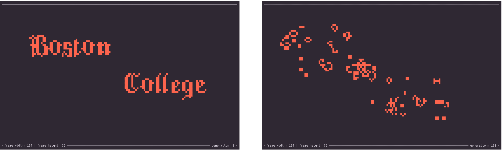

# Rusty Life Demo Project 
- Included in /rusty_life_DEMO
[Also available here](https://github.com/SebPuchi/Rusty-Life)

# Research Project
Complexity theory is an enormous field, and computability theory even bigger. There is no way to cover all of the topics in three semesters, let alone one. The purpose of this project is to make up for that, by allowing you to pick your own direction to go in and then giving you some room to do that. You'll be picking a topic of interest to you, learning that area of the theory yourself, and writing a report on it. I've given a list of topics below, but you are not required to choose one of them if you have an idea of your own. However, if you choose a topic which isn't one of the options I've given here, you'll need to bring it by me and tell me about it, to have it approved.
